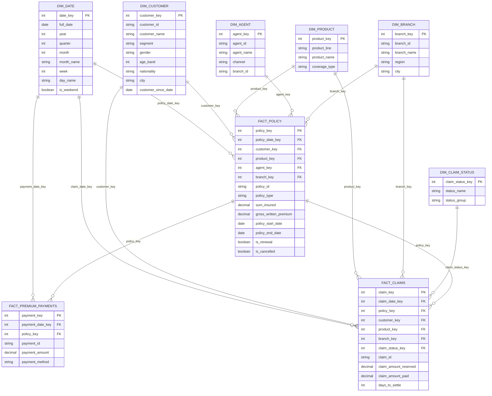

# Data Model: Star Schema Design

This warehouse uses a **star schema** (Kimball-style) — the industry-standard approach for insurance BI reporting, chosen for query performance and Power BI compatibility. Three fact tables share a set of conformed dimensions, which is what lets the Executive, Claims Ops, and Customer Analytics dashboards all agree with each other.

## ERD

## Fact table grain (critical design decision)

| Fact table | Grain (one row = ...) |
|---|---|
| `FACT_POLICY` | One policy transaction (new business, renewal, or cancellation event) |
| `FACT_CLAIMS` | One claim, at its current status snapshot |
| `FACT_PREMIUM_PAYMENTS` | One premium payment transaction against a policy |

## Why these dimensions

- **DIM_DATE**: standard conformed date dimension — enables time intelligence (YTD, MoM, rolling 12) in DAX without custom logic
- **DIM_CUSTOMER**: supports segmentation and retention analysis (Marketing's ask)
- **DIM_PRODUCT**: product-line cuts across all three departments' questions
- **DIM_AGENT / DIM_BRANCH**: separated because agents can move between branches — avoids a many-to-many trap
- **DIM_CLAIM_STATUS**: a small dimension with a `status_group` (Open/Closed) roll-up, used heavily in the Claims Ops dashboard

## Star vs. snowflake note

Branch and Agent are kept as separate flat dimensions rather than snowflaked (e.g., Agent → Branch → Region as separate normalized tables). For a BI-consumption layer this is intentional: Power BI performs best on wide, flattened dimension tables, and the job post specifically calls out models "optimized for analytical consumption" — that's a star schema, not a fully normalized snowflake.

## What's next (Stage 2)

Stage 2 generates synthetic CSV source data matching this exact model — customers, policies, claims, agents, branches, and payments — sized realistically (thousands of policies, multi-year history) so the SQL and Power BI work in later stages has real volume to chew on.
